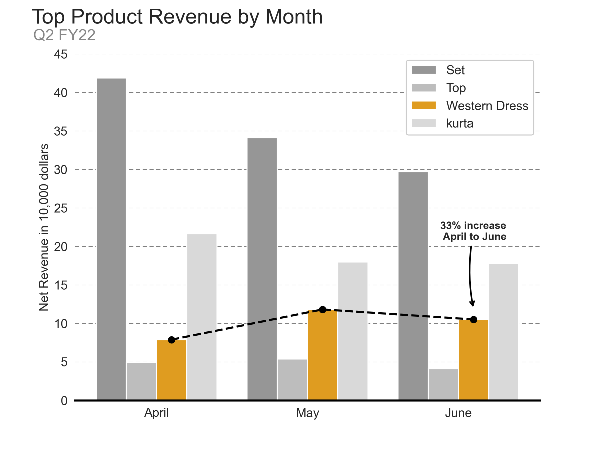
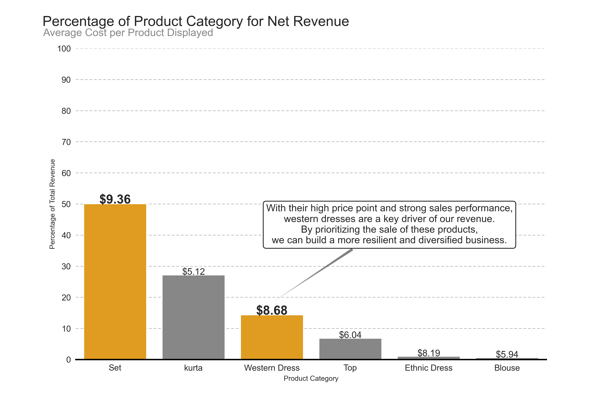
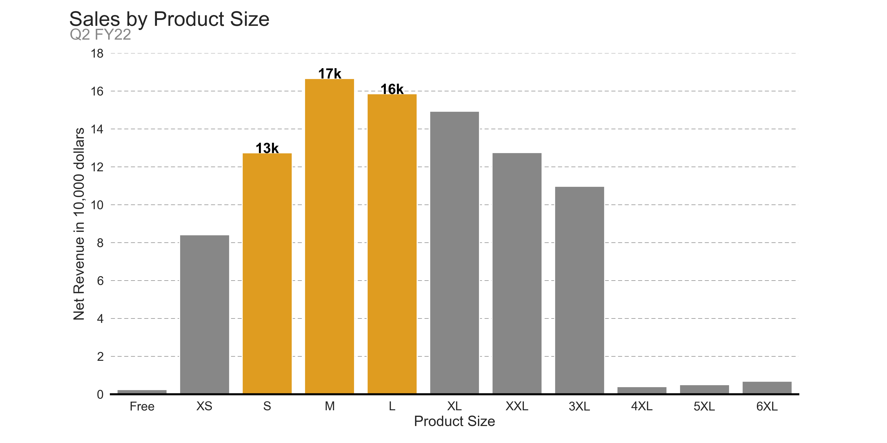
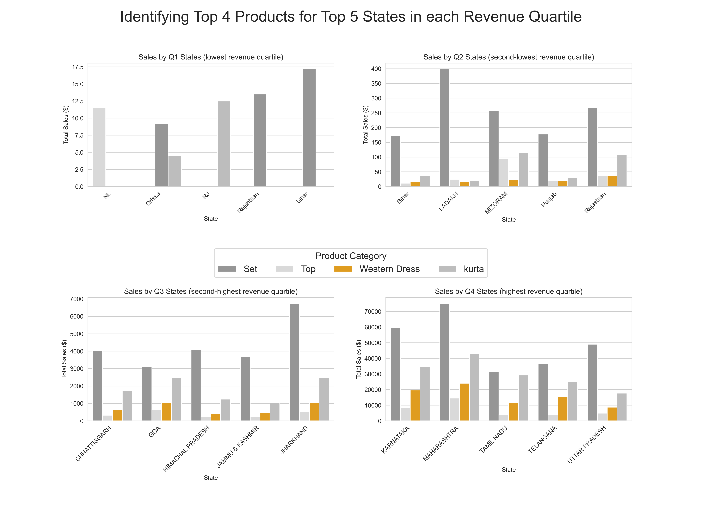

# 🛒 Amazon India Sales Analysis (Data Analyst Simulation Project)

## 📌 Problem Statement

In the dynamic world of e-commerce, understanding customer behavior, product performance, and regional sales trends is critical for business optimization. This project aims to simulate the role of a **Data Analyst** tasked with providing actionable insights from Amazon India's apparel sales data. Our objective is to uncover sales patterns, customer preferences, cancellations, and product performance to improve business strategy.

## 🧠 Objective

To conduct an end-to-end exploratory data analysis (EDA) on Amazon India's sales data and extract insights that can inform marketing decisions, product inventory, and customer segmentation strategies.

## 📊 Dataset

- **Source**: [Amazon Sales Dataset - Kaggle](https://www.kaggle.com/code/csanskriti/amazon-sales-data-analysis#Amazon-India-Sales-Dataset-Analysis)
- **Duration**: April, May, and June 2022
- **Attributes**: Product details, customer type, fulfillment method, order value, delivery status, geographic information, etc.

---

## 🔍 Key Questions Answered

- What are the top-performing product categories?
- How do customer types (Business vs. Individual) differ in spending?
- Which states drive the highest revenue?
- What months perform the best in terms of order value?
- Which product categories are frequently canceled or returned?

---

## 📈 Key Insights

- **Category Dominance**:
  - *'Set'* contributes ~50% of total revenue.
  - *'Kurta'* and *'Western Dress'* are the next top performers.

- **Cancellation & Returns**:
  - 14.22% of all orders were canceled.
  - 1.64% of all orders were returned.
  - This represents a combined 17.53% failure rate.

- **Regional Trends**:
  - Maharashtra, Karnataka, and Tamil Nadu lead in total sales.
  - State-level segmentation reveals specific category demand (e.g., *'Kurta'* in Andhra Pradesh).

- **Customer Type Behavior**:
  - *Business customers* spend more per order ($8.15) than *individuals* ($7.31).

- **Monthly Trends**:
  - April had the highest revenue.
  - May experienced a slight dip (~5.7% drop from April).

---

## 📌 Technologies Used

- Python (Pandas, Matplotlib, Seaborn)
- Jupyter Notebook
- Data Cleaning & Preprocessing
- Exploratory Data Analysis (EDA)
- GroupBy, Aggregation, Visualization

---

## 📷 Visual Outputs

| Visualization | Description |
|---------------|-------------|
|  | 'Set' leads monthly revenue; Western Dress shows 33% growth from April to June. |
|  | Sets contribute ~50% of total revenue; Western Dress has strong pricing and impact. |
|  | M, L, and S sizes account for majority revenue. XL+ sizes underperform. |
|  | Top states prefer Sets; Western Dresses growing in higher-revenue states. |

---

## 📚 What I Learned

- Real-world data cleaning and transformation
- Handling inconsistent categories and null values
- Visual storytelling with Matplotlib
- Interpreting business trends from numerical data
- Grouping & slicing data for targeted insights

